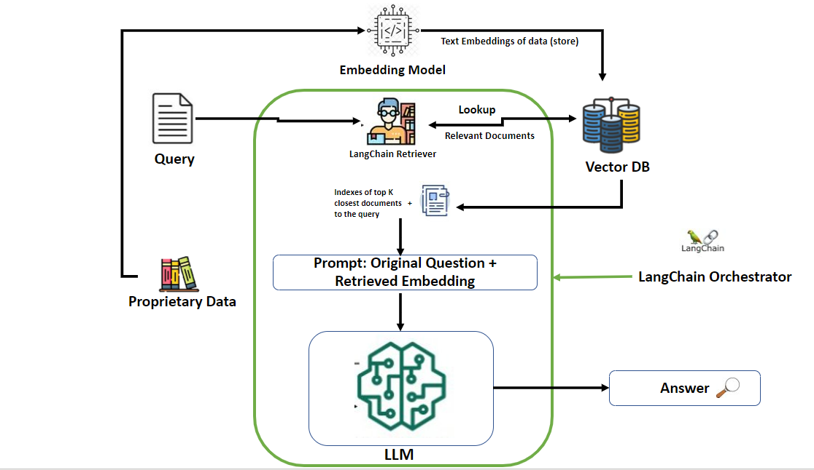

# Building RAG-based LLM Applications

Retrieval Augmented Generation (RAG) is a new generative paradigm that fuses Large Language Models and traditional Information Retrieval (IR) techniques, enabling seamless AI interactions leveraging your custom data.​

Two approaches can supplement the base model :​

* Fine-tuning or further training of the base model with new data, or​

* RAG that uses prompt engineering to supplement or guide the model in real time.​

## Technologies used

**Langchain** : LangChain is an open source framework that lets software developers working with artificial intelligence (AI) and its machine learning subset combine large language models with other external components to develop LLM-powered applications.

**Vector Database** : A vector database is a type of database that indexes and stores vector embeddings for fast retrieval and similarity search, with capabilities like CRUD operations, metadata filtering, and horizontal scaling.

**LLM** : A large language model (LLM) is a type of artificial intelligence (AI) program that can recognize and generate text, among other tasks.

<!--- **Blog post**: https://www.anyscale.com/blog/a-comprehensive-guide-for-building-rag-based-llm-applications-part-1
- **GitHub repository**: https://github.com/ray-project/llm-applications
- **Interactive notebook**: https://github.com/ray-project/llm-applications/blob/main/notebooks/rag.ipynb --->

In this guide, we will learn how to:

* 💻 Develop a retrieval augmented generation (RAG) based LLM application from scratch.
* 🚀 Scale the major components (load, chunk, embed, index, serve, etc.) in our application.
* 📦 Orchestrating LLM and VectoreDB using LangChain Framework.
* 💥 Share the benefits and limitation of LLM applications have had on our model.

## Architecture 

For architecture explaination, refer Blog 




## Setup

**API keys**
We'll be using Cohere to access LLM model like Cohere command model. And we can use any LLM API like Llama-2-70b, OPENAI chatgpt model. Be sure to create your accounts for both and have your credentials ready.

**Compute**
<details>
  <summary>Local</summary>
  You could run this on your local laptop but a we highly recommend using a setup with access to GPUs.
</details>


**Repository**
```bash
git clone <PUT YOUR GITHUB LINK>
git config --global user.name <GITHUB-USERNAME>
git config --global user.email <EMAIL-ADDRESS>
```

**Environment**

Then set up the environment correctly by specifying the values in your `.env` file,
and installing the dependencies:

```bash
pip install --user -r requirements.txt
export PYTHONPATH=$PYTHONPATH:$PWD
#pre-commit install
#pre-commit autoupdate
```

**Credentials** 
```bash
touch .env
# Add environment variables to .env
api_key = {cohere_api_key}
```

**Benefits**

The RAG for Question-Answering Models Project offers several benefits:

* Improved accuracy and relevance in question-answering responses.
* Real-time responsiveness for dynamic queries.
* Enhanced user satisfaction and trust in the question-answering system.
* Resource-efficient implementation for broader accessibility.
