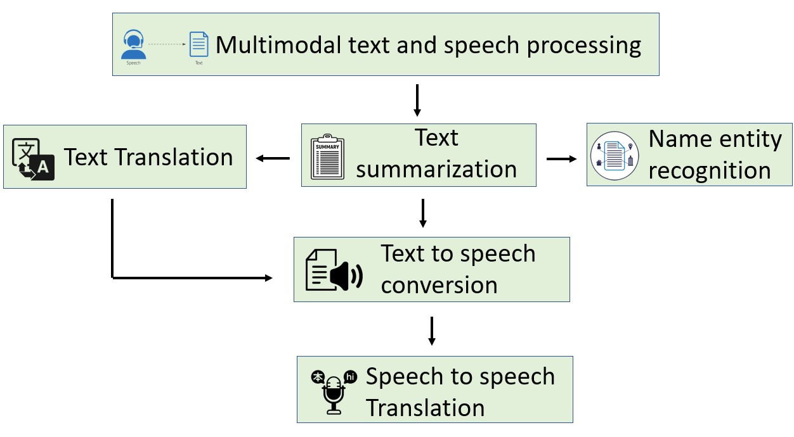

# Building MultiModal Text Processing using GenAI model

Multimodal NLP involves the combination of different types of information, such as text, speech, images, and videos, to enhance natural language processing tasks. This allows machines to better comprehend human communication by taking into account additional contextual information beyond just text. ​

APIs used in our usecase :​

* Cohere Summarize API for summarization of text in PDF format as input.

* Facebook seamless API for text-to-text and text-to-audio converstion from summarized text.

* Huggingface roberta API for Named Entity Recognition(NER) on text in PDF format as input.

## Technologies used

**For Summarization** : Cohere API, which simplifies text summarization by employing sophisticated natural language processing techniques, allowing for the efficient extraction of key information and the creation of coherent and condensed summaries.

**For Translation (text-to-text and text-to-audio)** : SeamlessM4T is the first all-in-one multilingual multimodal AI translation and transcription model. This single model can perform speech-to-text, speech-to-speech, text-to-speech, and text-to-text translations for up to 100 languages depending on the task.

**Hugginface NER Model** : bert-base-NER is a fine-tuned BERT model that is ready to use for Named Entity Recognition and achieves state-of-the-art performance for the NER task. It has been trained to recognize four types of entities: location (LOC), organizations (ORG), person (PER) and Miscellaneous (MISC).

In this guide, we will learn how to:
 
* 💻 Text Summarization is using Summarize-xlarge of Cohere 

* 🚀 Text translation is done using Base model of Cohere.

* 📦 Text to speech model was trained by kan-bayashi using ljspeech/tts1 recipe in espnet.

* 💥 Speech-to-Speech Translation is done using SeamlessM4T model by Huggingface.co

* 🚀 Named Entity Recognition is done using a fine-tuned version of xlm-roberta-base on the None dataset.


<!--- **Blog post**: https://www.anyscale.com/blog/a-comprehensive-guide-for-building-rag-based-llm-applications-part-1
- **GitHub repository**: https://github.com/ray-project/llm-applications
- **Interactive notebook**: https://github.com/ray-project/llm-applications/blob/main/notebooks/rag.ipynb --->


## Architecture 

For architecture explaination, refer Blog 




## Setup

**API keys**
We'll be using Cohere to access LLM model like Cohere command model. And we can use any LLM API like Llama-2-70b, OPENAI chatgpt model. Be sure to create your accounts for both and have your credentials ready.

**Compute**
<details>
  <summary>Local</summary>
  You could run this on your local laptop but a we highly recommend using a setup with access to GPUs.
</details>


**Repository**
```bash
git clone <PUT YOUR GITHUB LINK>
git config --global user.name <GITHUB-USERNAME>
git config --global user.email <EMAIL-ADDRESS>
```

**Environment**

Then set up the environment correctly by specifying the values in your `.env` file,
and installing the dependencies:

```bash
pip install --user -r requirements.txt
export PYTHONPATH=$PYTHONPATH:$PWD
#pre-commit install
#pre-commit autoupdate
```

**Credentials** 
```bash
touch .env
# Add environment variables to .env
api_key = {cohere_api_key}
```

**Benefits**

The Multimodal text processing Project offers several benefits:

* Enhanced Information Access: Enables access to content in multiple languages and formats.
* Efficient Content Processing: Saves time by summarizing and translating text and converting it to speech.
* Accessibility and Inclusivity: Supports visually impaired users and enhances accessibility.
* Content Customization: Allows users to focus on specific information.

**Limitations**

The Multimodal text processing Project offers several limitations:

* Large language models (LLMs) are prone to "hallucinations" generating fictitious information, presented as factual or accurate. 
* Generative AI models are not databases of knowledge but rather an attempt to synthesize and reproduce the information they have been trained on. 
* Many generative AI tools are not connected to the internet and cannot update or verify the content they generate.


