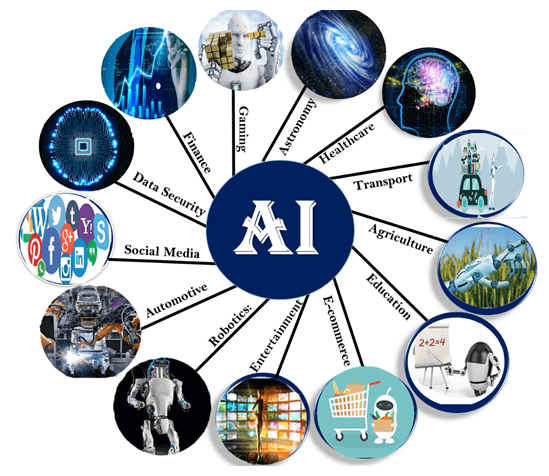

Gen AI Guide

Generative AI Documentation

**Table of Contents**

1. [Introduction](#Introduction)
   - [Overview of AI and Machine Learning](#overview-of-ai-and-machine-learning)
     - [Definition and History of AI](#definition-and-history-of-ai)
     - [Machine Learning vs. Deep Learning](#machine-learning-vs-deep-learning)
     - [Applications of AI](#applications-of-ai)
   - [Introduction to Generative AI](#introduction-to-generative-ai)
     - [What is Generative AI?](#what-is-generative-ai)
     - [Differences between Discriminative and Generative Models](#differences-between-discriminative-and-generative-models)
     - [Applications of Generative AI](#applications-of-generative-ai)

2. [Fundamental Concepts](#fundamental-concepts)
   - [Mathematics for Machine Learning](#mathematics-for-machine-learning)
     - [Linear Algebra](#linear-algebra)
     - [Probability and Statistics](#probability-and-statistics)
     - [Calculus](#calculus)
   - [Basics of Neural Networks](#basics-of-neural-networks)
     - [Perceptrons and Multilayer Perceptrons](#perceptrons-and-multilayer-perceptrons)
     - [Activation Functions](#activation-functions)
     - [Loss Functions and Optimization Techniques](#loss-functions-and-optimization-techniques)
   - [Autoencoders](#autoencoders)
     - [Basic Autoencoders](#basic-autoencoders)
     - [Variational Autoencoders (VAEs)](#variational-autoencoders)
     - [Applications of Autoencoders](#applications-of-autoencoders)
   - [Generative Adversarial Networks (GANs)](#generative-adversarial-networks)
     - [GAN Architecture](#gan-architecture)
     - [Training GANs](#training-gans)
     - [Types of GANs](#types-of-gans)

3. [Generative AI Techniques](#generative-ai-techniques)
   - [Transformer Models](#transformer-models)
     - [Attention Mechanism](#attention-mechanism)
     - [BERT and GPT Series](#bert-and-gpt-series)
     - [Applications in NLP](#applications-in-nlp)
   - [Diffusion Models](#diffusion-models)
     - [Basics of Diffusion Processes](#basics-of-diffusion-processes)
     - [Denoising Diffusion Probabilistic Models (DDPM)](#denoising-diffusion-probabilistic-models-ddpm)
     - [Applications of Diffusion Models](#applications-of-diffusion-models)
   - [Recurrent Neural Networks (RNNs)](#basic-rnns)
     - [Basic RNNs](#basic-rnns)
     - [Long Short-Term Memory (LSTM)](#long-short-term-memory-lstm)
     - [Applications of RNNs in Generative AI](#applications-of-rnns-in-generative-ai)

4. [Training Generative Models](#training-generative-models)
   - [Data Preprocessing](#data-preprocessing)
   - [Model Architecture](#model-architecture)
   - [Loss Functions](#loss-functions)
   - [Optimization Techniques](#optimization-techniques)
   - [Evaluation Metrics](#evaluation-metrics)

5. [Essential Tools and Frameworks](#essential-tools-and-frameworks)
   - [Programming Languages](#programming-languages)
     - [Python Basics](#python-basics)
   - [Libraries: NumPy, Pandas, Matplotlib](#libraries-numpy-pandas-matplotlib)
   - [Deep Learning Frameworks](#deep-learning-frameworks)
     - [TensorFlow](#tensorflow)
     - [PyTorch](#pytorch)
     - [Keras](#keras)

6. [Ethical and Practical Considerations](#ethical-and-practical-considerations)
   - [Ethical Implications of Generative AI](#ethical-implications-of-generative-ai)
     - [Deepfakes and Misinformation](#deepfakes-and-misinformation)
     - [Bias and Fairness](#bias-and-fairness)
     - [Privacy Concerns](#privacy-concerns)
   - [Best Practices](#best-practices)
     - [Responsible AI](#responsible-ai)
     - [Staying Up-to-Date with Research](#staying-up-to-date-with-research)

7. [Advanced Topics](#advanced-topics)
   - [Few-Shot Learning](#few-shot-learning)
   - [Zero-Shot Learning](#zero-shot-learning)
   - [Transfer Learning](#transfer-learning)
   - [Fine-Tuning Pre-trained Models](#fine-tuning-pre-trained-models)

8. [Applications of Generative AI](#applications-of-generative-ai)
   - [Image Generation](#image-generation)
   - [Text Generation](#text-generation)
   - [Speech Synthesis](#speech-synthesis)
   - [Data Augmentation](#data-augmentation)
   - [Style Transfer](#style-transfer)
   - [Applications across Industries](#applications-across-industries)

9. [Practical Implementation](#practical-implementation)
   - [Data Collection and Preprocessing](#data-collection-and-preprocessing)
   - [Model Training and Evaluation](#model-training-and-evaluation)
   - [Deployment of Generative Models](#deployment-of-generative-models)

10. [Popular Gen AI Models](#popular-gen-ai-models) 
    - [Text Generation Models](#text-generation-models)
        - [GPT-4](#gpt-4)
        - [LLaMA](#llama)
        - [Claude](#claude)
        - [Falcon](#falcon)
        - [Mistral](#mistral)
    - [Image Generation Models](#image-generation-models)
        - [DALL-E](#dall-e)
        - [Stable Diffusion](#stable-diffusion)
        - [Midjourney](#midjourney)
        - [Imagen](#imagen)
    - [Video Generation Models](#video-generation-models)
        - [Phenaki](#phenaki)
        - [Make-A-Video](#make-a-video)
        - [CogVideo](#cogvideo)
    - [Multimodal Models](#multimodal-models)
        - [GPT-4 Vision](#gpt-4-vision)
        - [CLIP](#clip)
        - [Blip-2](#blip-2)
        - [Flamingo](#flamingo)

11. [Case Studies and Real-World Application](#case-studies-and-real-world-application)
    - [Examples across various industries](#examples-across-various-industries)

12. [Resources and Further Learning](#resources-and-further-learning)

### 

### 

### Introduction

#### Overview of AI and Machine Learning
    
    

<i>Image Courtesy: https://community.aws/</i>

### **Definition and History of AI:** 
    Artificial Intelligence (AI) refers to
    the simulation of human intelligence in machines that are programmed to
    think and learn like humans. Artificial Intelligence, or AI, is the
    result of our efforts to automate tasks normally performed by humans,
    such as image pattern recognition, document classification, or a
    computerized chess rival.

    The history of artificial intelligence (AI) has ancient roots, with
    early concepts of independent machines dating back to ancient
    philosophers and inventors who created automatons. In the 20th century,
    significant advancements were made, beginning with the creation of
    simple robots and evolving into sophisticated AI systems.

    
Groundwork for AI (1900-1950):

    \- 1921: Karel Čapek's play introduces the term \"robot.\"

    \- 1949: Edmund Callis Berkley compares computers to human brains in his
    book.

Birth of AI (1950-1956):

    \- 1950: Alan Turing proposes the Turing Test.

    \- 1952: Arthur Samuel's checkers program learns independently.

    \- 1955: John McCarthy coins \"artificial intelligence.\"

AI Maturation (1957-1979):

    \- Development of key programming languages like LISP.

    \- Creation of early robots and AI systems like Unimate and ELIZA.

    \- 1979: Stanford Cart demonstrates autonomous navigation.

AI Boom (1980-1987):

    \- Growth in AI research and commercial applications, such as XCON.

    \- The Japanese Fifth Generation project and autonomous vehicle
    advancements.

AI Winter (1987-1993):

    \- Reduced funding and interest due to economic and technological
    setbacks.

AI Agents (1993-2011):

    \- Significant achievements like IBM\'s Deep Blue beating a chess
    champion.

    \- Introduction of AI in everyday life, such as the Roomba and virtual
    assistants like Siri.

    Artificial General Intelligence (2012-present):

    \- Advancements in deep learning and AI applications.

    \- Milestones include Google\'s neural network recognizing cats, IBM\'s
    Watson winning Jeopardy, and OpenAI\'s GPT-3 and DALL-E showcasing
    advanced AI capabilities.

    This historical overview highlights the progression of AI from early
    concepts to contemporary applications, reflecting its growing influence
    and integration into various aspects of life and technology.

### **Machine Learning vs. Deep Learning:**

    Machine Learning (ML) is a broad field within artificial intelligence (AI) that includes various techniques and algorithms used to enable computers to learn from data and make predictions or decisions without being explicitly programmed. It encompasses a wide range of data representation methods, typically involving structured data, where specific features are extracted and used for training. ML models, such as decision trees, support vector machines, and linear regression, are designed to handle thousands of data points and can produce outputs like numerical values or classifications.

    In contrast, Deep Learning (DL) is a specialized subset of Machine Learning that focuses on using artificial neural networks (ANNs) to model and understand complex patterns in data. DL excels in processing large volumes of unstructured data, such as images, text, and audio, by passing this data through multiple layers of interconnected neurons. This layered approach allows DL models to automatically extract and learn intricate features and representations from raw data. Unlike traditional ML algorithms, which often require manual feature engineering, DL models are capable of learning features directly from the data itself, making them particularly powerful for tasks like image recognition, natural language processing, and speech synthesis.

    Deep Learning can handle "big data," often involving millions of data points, and can produce outputs ranging from simple numerical predictions to more complex outputs like free-form text or sound. While ML algorithms are typically crafted by data analysts to target specific variables within datasets, DL models rely on neural network architectures that self-develop and optimize through training. This autonomy allows DL to address more complex machine learning challenges that traditional ML methods may struggle with. As an evolution of Machine Learning, Deep Learning represents how deeply models can be trained to learn from data, pushing the boundaries of AI capabilities.

## **Applications of AI:** 

<i>Image Courtesy: https://researchgate.net/</i>

AI has transformative applications across industries

**Applications of artificial intelligence (AI)**

There are many different applications of AI, including:

-   **[Natural language
    processing](https://cloud.google.com/learn/what-is-natural-language-processing) (NLP)**:
    NLP allows computers to understand and generate human language. This
    technology is used in a variety of applications, such as machine
    translation, spam filtering, and sentiment analysis.

-   **Computer vision**: Computer vision allows computers to identify
    and interpret visual content. This technology is used in a variety
    of applications, such as self-driving cars, facial recognition, and
    object detection.

-   **[Machine
    learning](https://cloud.google.com/learn/what-is-machine-learning) (ML)**:
    ML allows computers to learn from data and improve their performance
    over time. This technology is used in a variety of applications,
    such as predictive analytics, fraud detection, and recommendation
    systems.

-   **Robotics**: Robotics is the branch of AI that deals with the
    design, construction, and operation of robots. Robots are used in a
    variety of applications, such as manufacturing, healthcare, and
    space exploration.

## **AI in business intelligence**

AI is playing an increasingly important role in business intelligence
(BI). AI-powered BI tools can help businesses collect, analyze, and
visualize data more efficiently and effectively. This can lead to
improved decision-making, increased productivity, and reduced costs.

Some of the ways that AI is being used in BI include:

-   **Data collection**: Collecting data from a variety of sources,
    including structured data (for example, databases) and unstructured
    data (for example, text documents, images, and videos)

-   **Data analysis**: To analyze data and identify patterns, trends,
    and relationships

-   **Data visualization**: AI can help create visualizations that make
    it easier to understand data

-   **Decision-making**: Insights and recommendations generated by AI
    models can help drive data-driven decision-making for businesses

## **AI in healthcare**

AI is also playing an increasingly important role in healthcare.
AI-powered tools can help doctors diagnose diseases, develop new
treatments, and provide personalized care to patients. For example:

-   **Disease diagnosis**: AI can be used to analyze patient data and
    identify patterns that may indicate a disease. This can help doctors
    diagnose diseases earlier and more accurately.

-   **Treatment development**: By analyzing large datasets of patient
    data, AI can identify new patterns and relationships that can be
    used to develop new drugs and therapies.

-   **Personalized care**: By analyzing a patient\'s data, AI can help
    doctors develop treatment plans that are tailored to the patient\'s
    specific needs.

## **AI in education**

AI could be used in education to personalize learning, improve student
engagement, and automate administrative tasks for schools and other
organizations. 

-   **Personalized learning**: AI can be used to create personalized
    learning experiences for students. By tracking each student\'s
    progress, AI can identify areas where the student needs additional
    support and provide targeted instruction.

-   **Improved student engagement**: AI can be used to improve student
    engagement by providing interactive and engaging learning
    experiences. For example, AI-powered applications can provide
    students with real-time feedback and support.

-   **Automated administrative tasks**: Administrative tasks, such as
    grading papers and scheduling classes can be assisted by AI models,
    which will help free up teachers\' time to focus on teaching.

## **AI in finance**

AI can help [financial
services](https://cloud.google.com/solutions/financial-services/) institutions
in five general areas: personalize services and products, create
opportunities, manage risk and fraud, enable transparency and
compliance, and automate operations and reduce costs. For example:

-   **Risk and fraud detection**: Detect suspicious, potential money
    laundering activity faster and more precisely with AI.

-   **Personalized recommendations**: Deliver highly personalized
    recommendations for financial products and services, such as
    investment advice or banking offers, based on customer journeys,
    peer interactions, risk preferences, and financial goals.

-   **Document processing**: Extract structured and unstructured data
    from documents and analyze, search and store this data for
    document-extensive processes, such as loan servicing, and investment
    opportunity discovery.

## **AI in manufacturing**

Some ways that AI may be used in manufacturing include:

-   **Improved efficiency**: Automating tasks, such as assembly and
    inspection

-   **Increased productivity**: Optimizing production processes

-   **Improved quality**: AI can be used to detect defects and improve
    quality control

## **Additional AI applications**

In addition to the applications listed above, AI is also being used in a
variety of other industries, including:

-   **Retail**: AI is being used to personalize the shopping experience,
    recommend products, and manage inventory

-   **Transportation:** AI is being used to develop self-driving cars
    and improve traffic management

-   **Energy**: AI is being used to improve energy efficiency and
    predict energy demand

-   **Government**: AI is being used to improve public safety, detect
    crime, and provide citizen services

#### Introduction to Generative AI

### **What is Generative AI?:** 
    Generative AI focuses on creating new data
    instances that resemble training data. Unlike discriminative models that
    classify or predict outcomes based on existing data, generative models
    generate new examples. This capability is pivotal in tasks like image
    synthesis, language generation, and data augmentation. Generative AI
    refers to deep-learning models that can generate high-quality text,
    images, and other content based on the data they were trained on.

### **Differences between Discriminative and Generative Models:**

    Generative and discriminative models are two fundamental approaches to
    artificial intelligence (AI) that tackle classification problems in
    different ways:

    -   Generative models

    > Study the underlying structure of data, learning its patterns and
    > relationships. They can then generate new instances of data, and are
    > useful for tasks like data completion, anomaly detection, clustering,
    > and dimension. Generative models are statistical models of the joint
    > probability distribution between an observable variable and a target
    > variable. Examples of generative models include Naive Bayes.

    -   Discriminative models

    > Focus on learning the boundary between different classes or categories
    > within the data. They optimize this boundary for the best possible
    > classification accuracy. Discriminative models are models of the
    > conditional probability. Examples of discriminative models include
    > Logistic Regression, Support Vector Machines, and Decision
    > Trees. Discriminative models are ideal for classification tasks, such
    > as facial recognition and spam filtering. 

### **Applications of Generative AI:** 
Generative AI finds applications in diverse fields:

    Generative AI has many applications across industries, including
    healthcare, marketing, and finance:

    -Healthcare
    
        Generative AI can help with drug discovery and patient record
        management. It can also help physicians make diagnoses and treatment
        decisions by analyzing unstructured data in electronic health records.
    
    -Marketing
    
        Generative AI can create personalized content for marketing campaigns,
        such as social media posts, blog articles, and advertisements. It can
        also generate images and videos for ads that are tailored to specific
        audiences.
        
    -Finance
    
        Generative AI can help fintech companies generate reports faster and
        reduce errors. It can also analyze customer data to provide
        personalized financial advice.
    
    -Ecommerce
    
        Generative AI chatbots can provide customers with personalized
        information about products, pricing, and special offers. This can help
        companies reduce the need for a large customer support department.
    
    -Other industries
        
        Generative AI can also be used in fashion, gaming, entertainment,
        surveillance, education, media, and podcasting. It can create new
        content, prototypes, and solutions, such as realistic images, animated
        materials, and text

### 

### 

### 

### 

### 

### 

### 

### 

### 

### 

### 

### 

### 

### 

### 

### Fundamental Concepts

#### Mathematics for Machine Learning

<i>Image Courtesy: https://medium.com/</i>

### [Linear Algebra](https://www.javatpoint.com/linear-algebra-for-machine-learning)**:**

    Linear algebra provides the foundational mathematics for understanding
    and manipulating data in machine learning:

    Machine learning has a strong connection with mathematics. Each machine
    learning algorithm is based on the concepts of mathematics & also with
    the help of mathematics, one can choose the correct algorithm by
    considering training time, complexity, number of features,
    etc. ***Linear Algebra is an essential field of mathematics, which
    defines the study of vectors, matrices, planes, mapping, and lines
    required for linear transformation.***

    Linear algebra plays a vital role and key foundation in machine
    learning***, and it enables ML algorithms to run on a huge number of
    datasets***.

    The concepts of linear algebra are widely used in developing algorithms
    in machine learning. Although it is used almost in each concept of
    Machine learning, specifically, it can perform the following task:

    -   Optimization of data.

    -   Applicable in loss functions, regularisation, covariance matrices,
        Singular Value Decomposition (SVD), Matrix Operations, and support
        vector machine classification.

    -   Implementation of Linear Regression in Machine Learning.

    Besides the above uses, linear algebra is also used in neural networks
    and the data science field.

    Basic mathematics principles and concepts like Linear algebra are the
    foundation of Machine Learning and Deep Learning systems. To learn and
    understand Machine Learning or Data Science, one needs to be familiar
    with linear algebra and optimization theory. In this topic, we will
    explain all the Linear algebra concepts required for machine learning.

### [Probability and Statistics:](https://towardsdatascience.com/machine-learning-probability-statistics-f830f8c09326)

Probability theory is fundamental to machine learning algorithms,
enabling them to model uncertainty and make predictions based on data.
Here are the key concepts and their roles in machine learning:

**Probability Distributions**

**1. Normal (Gaussian) Distribution:**

-   **Definition:** A continuous probability distribution characterized
    by its bell-shaped curve, symmetric about the mean.

-   **Parameters:** Mean (μ) and standard deviation (σ).

-   **Applications:**

    -   **Central Limit Theorem:** The means of large samples of data
        tend to be normally distributed, regardless of the original data
        distribution.

    -   **Modeling:** Used in regression analysis, assumptions of
        normality for residuals, and in algorithms like Gaussian Naive
        Bayes.

**2. Bernoulli Distribution:**

-   **Definition:** A discrete probability distribution for a random
    variable that has two possible outcomes: success (1) or failure (0).

-   **Parameter:** Probability of success (p).

-   **Applications:**

    -   **Binary Classification:** Models binary outcomes in logistic
        regression.

    -   **Feature Modeling:** Used in Bernoulli Naive Bayes for
        binary/boolean features.

**3. Binomial Distribution:**

-   **Definition:** A discrete probability distribution that models the
    number of successes in a fixed number of independent Bernoulli
    trials.

-   **Parameters:** Number of trials (n) and probability of success (p).

-   **Applications:**

    -   **Event Modeling:** Used to predict the number of successes in
        experiments (e.g., number of defective items in a batch).

    -   **Sampling:** Helps in hypothesis testing and confidence
        intervals for proportions.

**Statistical Measures**

**1. Mean:**

-   **Definition:** The average of a set of numbers, representing the
    central value.

-   **Application:** Indicates the central tendency of data; used in
    algorithms like k-means clustering.

**2. Median:**

-   **Definition:** The middle value of a data set when ordered.

-   **Application:** Used to describe data distributions, especially
    when data is skewed, as it is less affected by outliers.

**3. Mode:**

-   **Definition:** The most frequent value in a data set.

-   **Application:** Useful for categorical data analysis, understanding
    the most common outcome.

**4. Variance:**

-   **Definition:** The average of the squared differences from the
    mean.

-   **Application:** Measures data spread or dispersion; high variance
    indicates wide data spread. Used in algorithms like PCA (Principal
    Component Analysis) to understand data variability.

**5. Standard Deviation:**

-   **Definition:** The square root of the variance, representing data
    spread around the mean.

-   **Application:** Indicates data variability; used in normal
    distribution to define confidence intervals.

**Statistical Inference**

**1. Hypothesis Testing:**

-   **Definition:** A method to test assumptions (hypotheses) about a
    population parameter based on sample data.

-   **Components:**

    -   **Null Hypothesis (H0):** Assumes no effect or difference.

    -   **Alternative Hypothesis (H1):** Assumes an effect or
        difference.

-   **Application:** Used in model evaluation to determine if results
    are statistically significant (e.g., A/B testing, comparing model
    performance).

**2. Confidence Intervals:**

-   **Definition:** A range of values that is likely to contain the
    population parameter with a specified probability (e.g., 95%
    confidence interval).

-   **Application:** Provides an estimate range for model parameters;
    helps in understanding the reliability of parameter estimates.

**3. P-values:**

-   **Definition:** The probability of observing the test results under
    the null hypothesis.

-   **Application:** Used in hypothesis testing to determine the
    significance of results. A low p-value (\< 0.05) typically indicates
    strong evidence against the null hypothesis, suggesting the result
    is statistically significant.

### [Calculus:](https://ml-cheatsheet.readthedocs.io/en/latest/calculus.html)

Calculus is integral to the mathematical framework underpinning
optimization algorithms used in training machine learning models. Here's
a detailed look at the key concepts and their applications:

**Differentiation**

**1. Computing Gradients:**

-   **Definition:** Differentiation involves calculating the derivative
    of a function, which represents the rate of change of the function
    with respect to its variables.

-   **Gradients:** The gradient is a vector of partial derivatives with
    respect to all model parameters. It indicates the direction and rate
    of the steepest ascent or descent.

-   **Application in ML:**

    -   **Loss Function Minimization:** Gradients are used to determine
        how to adjust model parameters to minimize the loss function.

    -   **Backpropagation:** In neural networks, gradients are computed
        using backpropagation to update weights during training.

**Integration**

**1. Probabilistic Modelling:**

-   **Definition:** Integration is the process of calculating the area
    under a curve. In machine learning, it is often used to aggregate
    probabilities and expected values.

-   **Application in ML:**

    -   **Expectation Calculations:** Integration is used to compute
        expectations (e.g., expected value of a probability
        distribution), which are crucial in probabilistic models.

    -   **Bayesian Inference:** Integration helps in marginalizing over
        distributions to obtain posterior probabilities.

**Optimization Techniques**

**1. Gradient Descent:**

-   **Definition:** Gradient descent is an optimization algorithm that
    iteratively adjusts model parameters to minimize the loss function.

-   **Process:**

    -   **Step 1:** Initialize parameters.

    -   **Step 2:** Compute the gradient of the loss function with
        respect to each parameter.

    -   **Step 3:** Update parameters in the direction opposite to the
        gradient (i.e., descent) by a step size (learning rate).

    -   **Step 4:** Repeat steps 2-3 until convergence.

-   **Application in ML:**

    -   **Batch Gradient Descent:** Uses the entire dataset to compute
        the gradient at each iteration, which can be computationally
        expensive for large datasets.

**2. Stochastic Gradient Descent (SGD):**

-   **Definition:** A variant of gradient descent where the gradient is
    computed using a randomly selected subset of the data (a mini-batch)
    rather than the entire dataset.

-   **Advantages:**

    -   **Efficiency:** Faster and more scalable for large datasets.

    -   **Convergence:** Introduces randomness, which can help escape
        local minima and achieve better solutions.

-   **Process:** Similar to gradient descent but updates parameters more
    frequently using mini-batches.

**3. Adam (Adaptive Moment Estimation):**

-   **Definition:** An advanced optimization algorithm that combines the
    benefits of both SGD and RMSprop, using adaptive learning rates for
    each parameter.

-   **Features:**

    -   **Moment Estimation:** Maintains running averages of both the
        gradients (first moment) and the squared gradients (second
        moment).

    -   **Bias Correction:** Adjusts the moment estimates to account for
        their bias towards zero at the start of training.

-   **Process:**

    -   **Step 1:** Initialize parameters and moment estimates.

    -   **Step 2:** Compute gradients and update the moment estimates.

    -   **Step 3:** Correct bias in the moment estimates.

    -   **Step 4:** Update parameters using the corrected moment
        estimates.

-   **Advantages:**

    -   **Adaptive Learning Rates:** Adjusts the learning rate for each
        parameter individually, improving convergence speed.

    -   **Efficiency:** Suitable for problems with large datasets and
        parameters.

#### 

#### Basics of Neural Networks

### **Perceptrons and Multilayer Perceptrons:**

Perceptrons and multilayer perceptrons (MLPs) are both types of neural
networks that are used for supervised learning:

-   Perceptrons

> A simple, two-layer network with one input and one output. Perceptrons
> can learn to classify linearly separable patterns, but not
> non-linearly separable patterns.

-   MLPs

> A more complex, feedforward neural network with at least one hidden
> layer between the input and output layers. MLPs can learn to classify
> both linearly separable and non-linearly separable patterns.

### [Activation Functions:](https://www.geeksforgeeks.org/activation-functions-neural-networks/)

An activation function in the context of neural networks is a
mathematical function applied to the output of a neuron. The purpose of
an activation function is to introduce non-linearity into the model,
allowing the network to learn and represent complex patterns in the
data. Without non-linearity, a neural network would essentially behave
like a linear regression model, regardless of the number of layers it
has.

The activation function decides whether a neuron should be activated or
not by calculating the weighted sum and further adding bias to it. The
purpose of the activation function is to introduce non-linearity into
the output of a neuron.

-   **ReLU (Rectified Linear Unit):** Simple yet effective activation
    function that outputs zero for negative inputs and linearly
    increases for positive inputs.

-   **Sigmoid:** S-shaped function that maps inputs to a range of \[0,
    1\], suitable for binary classification tasks.

-   **Tanh:** Similar to sigmoid but maps inputs to a range of \[-1,
    1\], used in models requiring outputs to be centred around zero.

### [Loss Functions and Optimization Techniques](https://machinelearningmastery.com/loss-and-loss-functions-for-training-deep-learning-neural-networks/)**:**

<i>Common Loss functions - 
Image Courtesy: https://geeksforgeeks.org/</i>

-   **Loss Functions:** Objective functions that quantify the model\'s
    prediction error during training:

    -   **Mean Squared Error (MSE):** Measures the average squared
        difference between predicted and actual values, commonly used in
        regression tasks.

    -   **Cross-Entropy Loss:** Measures the performance of
        classification models that output probabilities.

-   **Optimization Techniques:** Algorithms that adjust model parameters
    to minimize loss functions and improve predictive accuracy:

    -   **Gradient Descent:** Iterative process that adjusts model
        weights in the direction of the negative gradient of the loss
        function.

    -   **Stochastic Gradient Descent (SGD):** Variant of gradient
        descent that updates model parameters using a subset
        (mini-batch) of training data, reducing computational cost.

    -   **Adam Optimizer:** Adaptive optimization algorithm that
        computes individual learning rates for different model
        parameters, enhancing convergence speed and stability.

#### [Autoencoders](https://www.geeksforgeeks.org/auto-encoders/)

<i>Autoencoders - 
Image Courtesy: https://medium.com/</i>

Autoencoders are a specialized class of algorithms that can learn
efficient representations of input data with no need for labels. It is a
class of [artificial neural
networks](https://www.geeksforgeeks.org/artificial-neural-networks-and-its-applications/) designed
for [unsupervised
learning](https://www.geeksforgeeks.org/ml-types-learning-part-2/).
Learning to compress and effectively represent input data without
specific labels is the essential principle of an automatic decoder. This
is accomplished using a two-fold structure that consists of an encoder
and a decoder. The encoder transforms the input data into a
reduced-dimensional representation, which is often referred to as
"latent space" or "encoding". From that representation, a decoder
rebuilds the initial input. For the network to gain meaningful patterns
in data, a process of encoding and decoding facilitates the definition
of essential features.

### **Basic Autoencoders** 
Autoencoders are neural networks designed to
learn efficient representations of data:

-   **Encoder:** Network that compresses input data into a latent space
    representation (encoding).

-   **Decoder:** Network that reconstructs input data from the latent
    space representation (decoding).

-   **Applications:** Dimensionality reduction, anomaly detection, and
    denoising data.

### **Variational Autoencoders** 
VAEs extend basic autoencoders by introducing probabilistic components:

-   **Probabilistic Latent Space:** Represents data as a probability
    distribution, enabling generation of new data samples.

-   **Reparameterization Trick:** Technique that facilitates
    backpropagation through stochastic layers, crucial for training VAEs
    effectively.

-   **Applications:** Image generation, data synthesis, and
    representation learning in unsupervised settings.

### **Applications of Autoencoders:** 
Autoencoders find applications in various domains:

-   **Anomaly Detection:** Identifying rare events or outliers in data
    that deviate from normal patterns.

-   **Image Denoising:** Removing noise from images while preserving
    essential features.

-   **Data Compression:** Efficiently storing and transmitting data with
    reduced dimensionality.

### [**Generative Adversarial Networks**](https://www.geeksforgeeks.org/generative-adversarial-network-gan/)

<i>Generative Adversarial Networks - 
Image Courtesy: https://medium.com/</i>

#### GAN Architecture

Generative Adversarial Networks (GANs) consist of two neural networks:

-   **Generator:** Creates new data instances, such as images or text,
    from random noise or a latent space representation.

-   **Discriminator:** Classifies generated data as real or fake,
    providing feedback to the generator to improve its outputs.

#### Training GANs

Training GANs involves a minimax game where the generator aims to fool
the discriminator, while the discriminator strives to distinguish
between real and generated data:

-   **Loss Function:** Alternating updates of the generator and
    discriminator based on adversarial loss, typically binary
    cross-entropy.

-   **Convergence Challenges:** GAN training is delicate, prone to mode
    collapse (producing limited variety) or instability issues.

#### Types of GANs

Various GAN architectures address specific tasks and challenges:

-   **Conditional GANs:** Conditioned on additional information (labels,
    context) to generate specific outputs.

-   **StyleGAN:** Controls the style and appearance of generated images,
    facilitating high-quality image synthesis.

-   **CycleGAN:** Unpaired image-to-image translation, learning mappings
    between different domains without paired examples.

### **Generative AI Techniques**

Generative AI techniques encompass a range of models and methods that
can generate new data samples similar to the training data. Here\'s an
elaboration on the key techniques and their applications:

###  [**Transformer Models**](https://towardsdatascience.com/transformers-141e32e69591/)

<i>Transformer Models - 
Image Courtesy: https://nvidia.com/</i>

### [Attention Mechanism:](https://www.geeksforgeeks.org/ml-attention-mechanism/)

Transformers rely on attention mechanisms to process input data by
weighing the relevance of different parts of the input. This is crucial
for capturing long-range dependencies within the data.

-   **Self-Attention:**

    -   **Definition:** Self-attention computes attention scores across
        all positions in a sequence, allowing the model to consider the
        relationships between different words or tokens.

    -   **Process:** For each word in a sequence, self-attention
        calculates a weighted sum of the representations of all words in
        the sequence. This helps the model to understand context by
        considering all words simultaneously.

    -   **Application:** Enhances the understanding of context in tasks
        such as machine translation and text generation.

-   **Multi-Head Attention:**

    -   **Definition:** Multi-head attention consists of several
        self-attention mechanisms running in parallel. Each head learns
        to focus on different parts of the input data.

    -   **Process:** The outputs from multiple attention heads are
        concatenated and linearly transformed to produce the final
        output.

    -   **Application:** Improves model performance by allowing the
        model to jointly attend to information from different
        representation subspaces.

### **[BERT and GPT Series](https://blog.invgate.com/gpt-3-vs-bert/):**

-   **BERT (Bidirectional Encoder Representations from Transformers):**

    -   **Definition:** BERT is designed for natural language
        understanding tasks and is pre-trained on large text corpora.

    -   **Process:** BERT uses bidirectional self-attention, which
        allows it to consider context from both left and right of a
        target word.

    -   **Application:** Useful for tasks such as question answering,
        sentiment analysis, and named entity recognition.

-   **GPT (Generative Pre-trained Transformer):**

    -   **Definition:** GPT models focus on generative tasks, using a
        unidirectional transformer architecture to generate text.

    -   **Process:** GPT is pre-trained on a large text corpus and
        fine-tuned for specific tasks. It generates text by predicting
        the next word in a sequence.

    -   **Application:** Effective for text generation, dialogue
        systems, and content creation.

### [Applications in NLP](https://www.analyticsvidhya.com/blog/2019/06/understanding-transformers-nlp-state-of-the-art-models/):

-   **Language Translation:**

    -   **Definition:** Transformers are used to translate text between
        languages using encoder-decoder architectures.

    -   **Process:** The encoder processes the input text, and the
        decoder generates the translated output.

    -   **Application:** Widely used in machine translation services
        like Google Translate.

-   **Question Answering:**

    -   **Definition:** Transformers provide accurate answers to user
        queries by understanding context and retrieving relevant
        information.

    -   **Process:** The model processes a question and a context
        paragraph to extract the most relevant answer.

    -   **Application:** Used in virtual assistants and customer service
        bots.

-   **Text Summarization:**

    -   **Definition:** Condenses large bodies of text into concise
        summaries.

    -   **Process:** The model identifies and extracts key information
        while maintaining the essence of the original text.

    -   **Application:** Useful for summarizing articles, reports, and
        documents.

###  [**Diffusion Models**](https://lilianweng.github.io/posts/2021-07-11-diffusion-models/)

<i>Diffusion Processes - 
Image Courtesy: https://lilianweng.github.io/</i>

### **Basics of Diffusion Processes:**

Diffusion models simulate random movements of particles or values over
time and can be applied to generative tasks.

-   **Random Walks:**

    -   **Definition:** Mathematical framework describing paths taken by
        particles undergoing random motion.

    -   **Application:** Forms the basis for modeling probabilistic
        processes and can be used in finance, physics, and AI.

-   **Heat Equation:**

    -   **Definition:** A continuous diffusion model used to describe
        the distribution of heat (or other quantities) in a given region
        over time.

    -   **Application:** Used in image processing for tasks like
        denoising and smoothing.

###  **Denoising Diffusion Probabilistic Models (DDPM):**

-   **Definition:** DDPMs model the process of iteratively denoising
    images by diffusing noise levels across multiple iterations.

-   **Probabilistic Framework:** Expresses image generation as a series
    of denoising steps, progressively improving image quality.

-   **Application:** High-quality image synthesis, video generation, and
    artistic applications.

### **Applications of Diffusion Models:**

-   **Image Generation:**

    -   **Definition:** Producing realistic images with fine-grained
        details and natural textures.

    -   **Application:** Used in art, design, and entertainment
        industries.

-   **Video Prediction:**

    -   **Definition:** Forecasting future frames in videos based on
        observed sequences.

    -   **Application:** Critical for video editing, surveillance, and
        autonomous driving.

####  [**Recurrent Neural Networks**](https://aws.amazon.com/what-is/recurrent-neural-network/#:~:text=A%20recurrent%20neural%20network%20(RNN,a%20specific%20sequential%20data%20output./))

<i>Recurrent Neural Networks - 
Image Courtesy: https://medium.com/</i>

### **Basic RNNs:**

-   **Definition:** RNNs process sequential data by maintaining an
    internal state or memory that captures information about previous
    elements in the sequence.

-   **Applications:**

    -   **Time-Series Prediction:** Forecasting future values in
        sequential data, such as stock prices or weather patterns.

    -   **Sequence Modelling:** Capturing dependencies between elements
        in a sequence, essential for natural language generation.

### **Long Short-Term Memory (LSTM):**

-   **Definition:** LSTMs address the vanishing gradient problem in RNNs
    by incorporating gated mechanisms to control information flow.

-   **Components:**

    -   **Cell State:** Acts as long-term memory, retaining information
        over long sequences.

    -   **Gate Mechanisms:** Input, forget, and output gates regulate
        the flow of information, enabling effective learning and
        retention.

-   **Application:** Effective for tasks requiring long-range
    dependencies, such as text generation and speech recognition.

### **Applications of RNNs in Generative AI:**

-   **Text Generation:**

    -   **Definition:** Producing coherent and contextually relevant
        sentences or paragraphs based on learned patterns.

    -   **Application:** Used in chatbots, content creation, and
        storytelling.

-   **Music Composition:**

    -   **Definition:** Generating melodies and harmonies, preserving
        musical structure and style.

    -   **Application:** Useful for creating new music, aiding
        composers, and generating background scores.

### 

### 

### 

### 

### 

### 

### 

### 

### 

### 

### 

### 

### 

### 

### 

### 

### 

### 

### [Training Generative Models](https://deepchecks.com/how-to-train-generative-ai-models/)

<i>Training Generative Models - 
Image Courtesy: https://shopdev.co/</i>

Training generative models involves a series of steps and considerations
to ensure that the model learns effectively from the data and produces
high-quality outputs. Here's an elaboration on each component:

### **Data Preprocessing**

**1. Data Cleaning and Transformation:**

-   **Normalization:**

    -   **Definition:** Scaling numerical data to a standard range,
        typically between 0 and 1 or -1 and 1.

    -   **Purpose:** Ensures consistent input scales across features,
        which helps in stabilizing and accelerating the training
        process.

    -   **Methods:** Techniques like min-max scaling or z-score
        normalization.

-   **Handling Missing Values:**

    -   **Definition:** Addressing gaps in the dataset where values are
        missing.

    -   **Purpose:** Maintaining dataset integrity by preventing biases
        and errors during training.

    -   **Techniques:** Imputation methods such as mean, median, or mode
        imputation, as well as more advanced methods like K-nearest
        neighbors (KNN) imputation or using models to predict missing
        values.

-   **Feature Engineering:**

    -   **Definition:** Creating new features or transforming existing
        ones to enhance model performance.

    -   **Purpose:** Improve the model\'s ability to capture relevant
        patterns in the data.

    -   **Examples:** Creating interaction terms, polynomial features,
        or extracting features from date and time stamps.

**2. Data Augmentation:**

-   **Techniques:**

    -   **Definition:** Generating synthetic data points by applying
        various transformations.

    -   **Purpose:** Increase dataset diversity, which helps in
        improving model robustness and generalization.

    -   **Methods:** Rotations, translations, flips, cropping, adding
        noise, and more complex methods like SMOTE (Synthetic Minority
        Over-sampling Technique).

-   **Applications:**

    -   **Improving Robustness:** Exposing the model to a broader range
        of data variations to enhance its ability to generalize to new,
        unseen data.

    -   **Examples:** In image processing, augmenting images through
        rotations and flips; in text processing, using paraphrasing or
        synonym replacement.

### **Model Architecture**

**1. Architecture Design:**

-   **Choice of Model:**

    -   **Definition:** Selecting the appropriate neural network
        architecture based on task requirements and data
        characteristics.

    -   **Examples:** Convolutional Neural Networks (CNNs) for image
        data, Recurrent Neural Networks (RNNs) for sequential data, and
        Transformers for tasks involving attention mechanisms.

-   **Complexity Management:**

    -   **Definition:** Balancing model complexity with computational
        resources and performance metrics.

    -   **Purpose:** Avoiding overfitting while ensuring the model is
        powerful enough to learn the underlying data patterns.

    -   **Techniques:** Using regularization methods like dropout, L2
        regularization, and pruning.

-   **Hyperparameter Tuning:**

    -   **Definition:** Adjusting model parameters such as learning
        rate, batch size, and the number of layers to optimize training
        efficiency and convergence.

    -   **Purpose:** Finding the optimal settings that lead to the best
        performance.

    -   **Methods:** Grid search, random search, and more sophisticated
        methods like Bayesian optimization or hyperband.

### **Loss Functions**

**1. Role in Training:**

-   **Objective Functions:**

    -   **Definition:** Functions that define the goals for model
        optimization.

    -   **Purpose:** Guide the learning process towards minimizing
        prediction errors or maximizing accuracy.

-   **Types of Loss Functions:**

    -   **MSE (Mean Squared Error):** Commonly used in regression tasks
        to measure the average squared difference between predicted and
        actual values.

    -   **Cross-Entropy Loss:** Used in classification tasks to measure
        the difference between predicted probability distributions and
        the actual distribution.

    -   **KL Divergence (Kullback-Leibler Divergence):** Used in
        generative modeling to measure how one probability distribution
        diverges from a second, expected probability distribution.

### **Optimization Techniques**

**1. Gradient Descent Variants:**

-   **Stochastic Gradient Descent (SGD):**

    -   **Definition:** An iterative optimization method that updates
        model parameters using mini-batches of data.

    -   **Purpose:** Helps in reducing computational load and improving
        convergence speed.

    -   **Process:** Computes the gradient of the loss function with
        respect to the model parameters and updates the parameters in
        the direction of the negative gradient.

-   **Adam Optimizer:**

    -   **Definition:** An adaptive optimization algorithm that adjusts
        learning rates for individual parameters.

    -   **Purpose:** Combines the benefits of SGD with adaptive learning
        rates to enhance convergence speed and stability.

    -   **Process:** Uses first and second moments of gradients to adapt
        the learning rate, making it effective for sparse gradients and
        non-stationary objectives.

### **Evaluation Metrics**

**1. Performance Assessment:**

-   **Quantitative Metrics:**

    -   **Accuracy:** The proportion of correctly predicted instances
        over the total instances.

    -   **Precision:** The ratio of true positive predictions to the sum
        of true positive and false positive predictions.

    -   **Recall:** The ratio of true positive predictions to the sum of
        true positive and false negative predictions.

    -   **F1 Score:** The harmonic mean of precision and recall,
        providing a balance between the two metrics.

    -   **Application:** Evaluating model performance on classification
        and regression tasks.

-   **Qualitative Assessment:**

    -   **Visual Inspection:** For generative models, visual inspection
        is crucial as quantitative metrics may not capture all aspects
        of output quality.

    -   **Human Judgment:** Used in subjective domains like image or
        text generation where human evaluators assess the realism,
        coherence, and creativity of the generated content.

    -   **Examples:** Evaluating image quality in GAN-generated images
        or coherence in generated text by models like GPT.

### Essential Tools and Frameworks
### Programming Languages
### [**Python Basics**](https://www.geeksforgeeks.org/python-basics/)

**1. Syntax and Semantics:**

-   **Syntax:**

    -   **Definition:** The set of rules that define the structure of
        Python code.

    -   **Elements:**

        -   **Variables:** Containers for storing data values. Example:
            x = 5.

        -   **Data Types:** Different types of data that Python can
            handle, such as integers, floats, strings, lists, tuples,
            dictionaries, and sets.

        -   **Control Structures:** Constructs that control the flow of
            execution. Examples include if, else, for, while, and
            try-except blocks.

-   **Semantics:**

    -   **Definition:** The meaning of the syntactic elements and how
        they interact during the execution of a Python program.

    -   **Examples:** Understanding how a for loop iterates over a list,
        or how function calls work.

**2. Functional Programming:**

-   **Functions:**

    -   **Definition:** Blocks of reusable code that perform a specific
        task. Defined using the def keyword. Example:

>
> def add(a, b):
>
> return a + b

-   **Lambda Expressions:**

    -   **Definition:** Anonymous functions defined using the lambda
        keyword. Example:

>
> add = lambda a, b: a + b

-   **List Comprehensions:**

    -   **Definition:** Concise way to create lists. Example:

>
> squares = \[x\*\*2 for x in range(10)\]

### **Libraries: NumPy, Pandas, Matplotlib**

**1. [NumPy](https://www.w3schools.com/python/numpy/numpy_intro.asp):**

-   **Numerical Operations:**

    -   **Arrays and Matrices:** Efficient handling of large arrays and
        matrices. Example:

>
> import numpy as np
>
> arr = np.array(\[1, 2, 3\])

-   **Mathematical Operations:**

    -   **Functions:** Supports a wide range of mathematical functions
        such as sum(), mean(), std(), etc. Example:

>
> np.sum(arr)

-   **Array Manipulation:**

    -   **Reshaping:** Changing the shape of an array without changing
        its data. Example:

>
> arr = np.array(\[\[1, 2\], \[3, 4\]\])
>
> arr.reshape((4, 1))

-   **Broadcasting:**

    -   **Definition:** Extending operations to arrays of different
        shapes. Example:

>
> a = np.array(\[1, 2, 3\])
>
> b = np.array(\[4\])
>
> a + b \# Outputs: array(\[5, 6, 7\])

**2. [Pandas](https://www.w3schools.com/python/pandas/default.asp):**

-   **Data Manipulation:**

    -   **DataFrame:** Two-dimensional labeled data structure. Example:

>
> import pandas as pd
>
> df = pd.DataFrame({\'A\': \[1, 2\], \'B\': \[3, 4\]})

-   **Filtering and Aggregating:**

    -   **Operations:** Filtering rows, aggregating data, and grouping
        data. Example:

>
> df_filtered = df\[df\[\'A\'\] \> 1\]
>
> df_grouped = df.groupby(\'A\').sum()

-   **Exploratory Data Analysis (EDA):**

    -   **Description:** Techniques to summarize the main
        characteristics of a dataset. Example:

>
> df.describe()

-   **Integration with NumPy:**

    -   **Definition:** Seamless interoperability with NumPy arrays.
        Example:

>
> df_numpy = df.to_numpy()

**3. [Matplotlib](https://www.w3schools.com/python/matplotlib_pyplot.asp):**

-   **Data Visualization:**

    -   **Plots and Charts:** Creating various types of visualizations.
        Example:

>
> import matplotlib.pyplot as plt
>
> plt.plot(\[1, 2, 3\], \[4, 5, 6\])
>
> plt.show()

-   **Customization:**

    -   **Visual Elements:** Customizing plots with titles, labels, and
        annotations. Example:

>
> plt.title(\'My Plot\')
>
> plt.xlabel(\'X-axis\')
>
> plt.ylabel(\'Y-axis\')

### **Deep Learning Frameworks**

### **[TensorFlow](https://www.geeksforgeeks.org/introduction-to-tensorflow/):**

-   **Graph Computation:**

    -   **Definition:** Building and executing computational graphs for
        model training and deployment. Example:

>
> import tensorflow as tf
>
> x = tf.placeholder(tf.float32, shape=\[None, 784\])
>
> W = tf.Variable(tf.zeros(\[784, 10\]))
>
> y = tf.matmul(x, W)

-   **Keras Integration:**

    -   **High-Level API:** Simplifies building neural networks.
        Example:

>
> from tensorflow.keras.models import Sequential
>
> from tensorflow.keras.layers import Dense
>
> model = Sequential(\[
>
> Dense(128, activation=\'relu\', input_shape=(784,)),
>
> Dense(10, activation=\'softmax\')
>
> \])

### **[PyTorch](https://github.com/yunjey/pytorch-tutorial):**

-   **Dynamic Computational Graphs:**

    -   **Definition:** Dynamic graph construction for flexible and
        iterative model modifications. Example:

>
> import torch
>
> x = torch.tensor(\[1.0, 2.0\], requires_grad=True)
>
> y = x \*\* 2
>
> y.backward()

-   **CUDA Support:**

    -   **Definition:** GPU acceleration for training and inference.
        Example:

>
> device = torch.device(\'cuda\' if torch.cuda.is_available() else
> \'cpu\')
>
> model.to(device)

### **[Keras](https://github.com/keras-team/keras):**

-   **User-Friendly API:**

    -   **Definition:** Abstracts complex neural network operations.
        Example:

>
> from keras.models import Sequential
>
> from keras.layers import Dense
>
> model = Sequential(\[
>
> Dense(128, activation=\'relu\', input_shape=(784,)),
>
> Dense(10, activation=\'softmax\')
>
> \])

-   **Backend Flexibility:**

    -   **Definition:** Backend-agnostic interface supporting
        TensorFlow, Theano, and CNTK. Example:

>
> from keras import backend as K
>
> K.set_backend(\'tensorflow\')

### Ethical and Practical Considerations

#### Ethical Implications of Generative AI

#### Deepfakes and Misinformation

**1. Manipulated Media:**

-   **Definition and Techniques:**

    -   **Deepfake Creation:** Deepfakes use Generative Adversarial
        Networks (GANs) or other advanced machine learning techniques to
        create realistic images, videos, and audio. These techniques
        involve a generator model that creates fake content and a
        discriminator model that evaluates its authenticity.

    -   **Applications and Misuse:** While deepfakes can be used for
        entertainment, education, and artistic purposes, their misuse
        poses significant ethical challenges. For example, creating fake
        news videos of political figures can manipulate public opinion
        and spread misinformation rapidly.

-   **Impacts:**

    -   **Trust Erosion:** The ability to fabricate highly realistic
        content undermines public trust in digital media, making it
        difficult to distinguish between genuine and fake information.
        This can lead to skepticism and reduced trust in legitimate news
        sources.

    -   **Psychological Effects:** Victims of deepfake pornography or
        other malicious uses suffer psychological harm, including
        anxiety, stress, and reputational damage.

**2. Policy and Regulation:**

-   **Current Efforts and Proposals:**

    -   **Legal Actions:** Countries are beginning to enact laws
        specifically targeting the creation and distribution of
        deepfakes. For instance, in the US, some states have passed laws
        criminalizing the use of deepfakes for malicious purposes, such
        as non-consensual pornography and election interference.

    -   **Regulatory Frameworks:** Broader frameworks are being
        discussed at international levels to standardize regulations and
        ensure cross-border cooperation in tackling deepfake-related
        crimes.

-   **Challenges and Solutions:**

    -   **Detection Technology:** Developing robust detection algorithms
        is critical. Techniques include forensic analysis, watermarking
        authentic media, and using AI to identify inconsistencies in
        lighting, shadows, and other features.

    -   **Public Awareness:** Educating the public about the existence
        and risks of deepfakes is essential. Media literacy programs can
        help individuals critically evaluate the content they consume.

### Bias and Fairness

#### Algorithmic Fairness

**1. Data Bias:**

-   **Origins of Bias:**

    -   **Historical Bias:** Data reflecting historical inequalities and
        stereotypes can encode these biases into AI models. For example,
        a resume screening tool trained on biased historical hiring data
        may discriminate against certain groups.

    -   **Selection Bias:** If the training data is not representative
        of the entire population (e.g., over-representing a particular
        demographic), the model\'s predictions will be skewed.

-   **Impact on Society:**

    -   **Discriminatory Outcomes:** Biased AI systems can result in
        unfair treatment in critical areas like hiring, lending, law
        enforcement, and healthcare. This perpetuates systemic
        inequality and exacerbates social injustices.

    -   **Loss of Trust:** If AI systems are perceived as biased, public
        trust in AI technologies diminishes, hindering their adoption
        and potential benefits.

**2. Fairness Metrics and Mitigation:**

-   **Quantifying Bias:**

    -   **Disparate Impact Analysis:** Measures the adverse impact on
        protected groups. For instance, in hiring, this analysis
        assesses whether the selection rate for a particular group is
        less than 80% of the rate for the most favored group.

    -   **Equal Opportunity Measures:** Ensure that models provide equal
        true positive rates for different groups. For example, in a loan
        approval model, this ensures that the likelihood of approving a
        deserving candidate\'s loan is the same across different
        demographics.

-   **Mitigating Bias:**

    -   **Preprocessing Techniques:** These include re-weighting samples
        to ensure balanced representation or generating synthetic data
        to balance the dataset.

    -   **In-Processing Techniques:** Algorithms like Fairness
        Constraints and Adversarial Debiasing directly incorporate
        fairness objectives into the model training process.

    -   **Post-Processing Techniques:** Adjusting the final model
        predictions to improve fairness metrics, such as through
        recalibration techniques that adjust scores to achieve fairness
        after model training.

### Privacy Concerns

#### Data Protection

**1. Safeguarding Personal Information:**

-   **Importance:**

    -   **User Trust:** Protecting personal data is crucial for
        maintaining user trust and ensuring the ethical use of AI
        technologies. Users must feel confident that their data is
        secure and used responsibly.

    -   **Regulatory Compliance:** Organizations must comply with data
        protection regulations like GDPR and CCPA to avoid legal
        penalties and maintain their reputations.

-   **Regulations:**

    -   **GDPR (General Data Protection Regulation):** Enforces strict
        rules on data processing, giving individuals rights over their
        personal data, such as the right to access, rectify, and erase
        their data.

    -   **CCPA (California Consumer Privacy Act):** Provides California
        residents with rights to know what personal data is collected,
        to whom it is sold, and to opt out of its sale.

**2. Anonymization Techniques:**

-   **Methods and Applications:**

    -   **Data Masking:** Temporarily replaces sensitive information
        with anonymized values for use in development and testing
        environments.

    -   **Pseudonymization:** Involves replacing private identifiers
        with pseudonyms, making it difficult to identify individuals
        while retaining data utility.

    -   **Differential Privacy:** Adds statistical noise to datasets to
        protect individual identities while allowing aggregate data
        analysis. For example, differential privacy can be used to
        release useful statistics about a population without revealing
        information about any individual.

### Best Practices

#### Responsible AI

**1. Ethical Frameworks:**

-   **Embedding Ethics:**

    -   **Transparency:** AI systems should be transparent about their
        data sources, algorithms, and decision-making processes. This
        includes clear documentation and open communication with users
        and stakeholders.

    -   **Accountability:** Organizations should establish
        accountability mechanisms to ensure that AI systems\' decisions
        can be audited and explained. This might involve maintaining
        detailed logs of model decisions and the data they were based
        on.

    -   **Human-Centric Design:** AI systems should prioritize human
        welfare, safety, and autonomy. This involves designing AI
        systems that complement human decision-making and provide
        meaningful control to users.

**2. Model Explainability:**

-   **Importance and Techniques:**

    -   **Interpretable Models:** Use simpler models where possible, as
        they are easier to understand and explain. For example, decision
        trees and linear regression models are more interpretable than
        complex neural networks.

    -   **Post-Hoc Explanations:** For complex models, use techniques
        like LIME (Local Interpretable Model-agnostic Explanations) and
        SHAP (SHapley Additive exPlanations) to provide explanations for
        individual predictions. These techniques help users understand
        the factors influencing specific model outputs.

#### Staying Up-to-Date with Research

**1. Continuous Learning:**

-   **Engaging with Research:**

    -   **Reading Papers:** Regularly review the latest research papers
        from conferences like NeurIPS, ICML, and CVPR. This helps stay
        informed about new techniques, breakthroughs, and best
        practices.

    -   **Online Courses and Workshops:** Participate in courses and
        workshops from platforms like Coursera, edX, and Udacity to
        continually enhance skills and knowledge in AI and machine
        learning.

**2. Community Engagement:**

-   **Collaborative Projects:**

    -   **Forums and Conferences:** Attend forums and conferences to
        network with other professionals, exchange ideas, and stay
        updated on industry trends. Examples include the annual AI
        conference at MIT and the O\'Reilly AI Conference.

    -   **Open Source Contributions:** Contribute to open source
        projects on platforms like GitHub. This allows collaboration
        with the broader AI community, sharing insights, and advancing
        the field together.

### 

### 

### 

### 

### 

### Advanced Topics

### [Few-Shot Learning](https://www.v7labs.com/blog/few-shot-learning-guide)

<i>Few-Shot Learning - 
Image Courtesy: https://www.v7labs.com/</i>

#### Learning with Limited Data

**1. Meta-Learning Approaches:**

-   **Definition:**

    -   Meta-learning, or \"learning to learn,\" involves training
        models to adapt quickly to new tasks with limited data by
        leveraging prior knowledge from related tasks.

-   **Techniques:**

    -   **Model-Agnostic Meta-Learning (MAML):** A popular approach
        where models are trained on a variety of tasks such that they
        can be fine-tuned on new tasks with only a few examples.

    -   **Prototypical Networks:** These use few-shot learning by
        computing the distance of a sample to prototype representations
        of each class, enabling quick adaptation.

-   **Advantages:**

    -   **Efficiency:** Reduces the need for extensive labelled data,
        which can be expensive and time-consuming to collect.

    -   **Versatility:** Enables models to generalize to new, unseen
        tasks or environments rapidly.

**2. Applications:**

-   **Healthcare:**

    -   **Disease Diagnosis:** Utilizing few-shot learning for rare
        diseases where labelled data is scarce, improving diagnostic
        accuracy with minimal examples.

-   **Natural Language Processing:**

    -   **Text Classification:** Adapting models to classify text into
        new categories with only a few labelled instances per category.

-   **Robotics:**

    -   **Task Adaptation:** Allowing robots to learn new tasks or
        actions with minimal demonstrations, enhancing their flexibility
        in dynamic environments.

### [Zero-Shot Learning](https://www.v7labs.com/blog/zero-shot-learning-guide)

<i>Zero-Shot Learning - 
Image Courtesy: https://encord.com/</i>

#### Knowledge Transfer

**1. Semantic Embeddings:**

-   **Definition:**

    -   Semantic embeddings map input data into a high-dimensional space
        where similar entities (e.g., words, images) are closer
        together.

-   **Techniques:**

    -   **Word Embeddings:** Using models like Word2Vec or GloVe to
        represent words in a continuous vector space based on their
        contextual similarity.

    -   **Image Embeddings:** Leveraging models like CLIP (Contrastive
        Language-Image Pre-Training) to create joint representations of
        text and images.

-   **Advantages:**

    -   **Versatility:** Enables models to understand and infer
        relationships between unseen classes based on their semantic
        similarity to known classes.

**2. Semantic Attributes:**

-   **Definition:**

    -   Objects or concepts are described through a set of interpretable
        attributes (e.g., a zebra has stripes, is black and white) that
        facilitate recognition without explicit training examples.

-   **Techniques:**

    -   **Attribute-Based Classification:** Models learn to associate
        semantic attributes with class labels, enabling zero-shot
        classification.

-   **Applications:**

    -   **Image Recognition:** Identifying new objects based on their
        described attributes without having seen them during training.

    -   **Language Understanding:** Interpreting and classifying new
        words or phrases based on their semantic context and
        relationship to known terms.

### Transfer Learning

#### Knowledge Reusability

**1. Pre-trained Models:**

-   **Definition:**

    -   Pre-trained models are trained on large, diverse datasets and
        can be reused for specific tasks by leveraging their learned
        representations.

-   **Advantages:**

    -   **Efficiency:** Reduces training time and computational
        resources needed for task-specific models.

    -   **Performance:** Often results in higher accuracy and
        robustness, as the models start with a strong foundational
        knowledge.

-   **Examples:**

    -   **BERT:** Pre-trained on a large corpus of text and used for
        various NLP tasks like question answering and sentiment
        analysis.

    -   **ResNet:** Pre-trained on ImageNet for image recognition tasks,
        then fine-tuned for specific applications like medical image
        analysis.

**2. Fine-Tuning:**

-   **Definition:**

    -   Fine-tuning involves further training a pre-trained model on a
        specific task or dataset to adapt its parameters for optimal
        performance in that domain.

-   **Techniques:**

    -   **Layer Freezing:** Initially freezing the early layers of the
        pre-trained model to preserve generic features and only training
        the later layers on the new task.

    -   **Gradual Unfreezing:** Gradually unfreezing layers of the model
        and fine-tuning them to adapt to the new task more effectively.

-   **Applications:**

    -   **Domain-Specific Adaptation:** Fine-tuning models for specific
        industries or applications, such as adapting a general language
        model to legal or medical text.

### [Fine-Tuning Pre-trained Models](https://www.analyticsvidhya.com/blog/2017/06/transfer-learning-the-art-of-fine-tuning-a-pre-trained-model/)

<i>
Fine-Tuning Pre-trained Models - 
Image Courtesy: https://medium.com/</i>

#### Adaptation Strategies

**1. Task-Specific Tuning:**

-   **Definition:**

    -   Adapting model weights or layers to optimize performance on
        specific objectives or datasets.

-   **Techniques:**

    -   **Custom Loss Functions:** Designing loss functions tailored to
        the specific task to better guide the learning process.

    -   **Data Augmentation:** Enhancing the training data with
        transformations to improve model robustness and generalization.

-   **Examples:**

    -   **Image Classification:** Fine-tuning a model on a specific set
        of classes, adjusting for nuances in the new dataset.

    -   **Text Generation:** Adapting a language model to generate
        domain-specific content, such as technical documentation or
        creative writing.

**2. Hyperparameter Optimization:**

-   **Definition:**

    -   Iteratively adjusting model configurations (e.g., learning rate,
        batch size) to maximize task performance and convergence speed.

-   **Techniques:**

    -   **Grid Search:** Systematically exploring a predefined set of
        hyperparameters to find the optimal combination.

    -   **Random Search:** Randomly sampling hyperparameters within
        specified ranges, often more efficient than grid search for
        high-dimensional spaces.

    -   **Bayesian Optimization:** Using probabilistic models to predict
        the performance of different hyperparameter combinations and
        iteratively refining the search.

-   **Applications:**

    -   **Model Training:** Fine-tuning models for specific tasks, such
        as tuning a neural network for image recognition to achieve the
        highest accuracy.

    -   **Algorithm Selection:** Selecting the best algorithms and
        hyperparameters for machine learning pipelines in automated
        machine learning (AutoML) frameworks.

### 

### 

### 

### 

### 

### 

### 

### 

### 

### 

### 

### 

### 

### [Applications of Generative AI](https://www.turing.com/resources/generative-ai-applications)

Generative AI has become a powerful tool across various domains,
enabling the creation of new data, enhancing existing datasets, and
automating complex tasks. Here\'s an in-depth look at its applications:

### Image Generation

#### Creative Outputs

**1. GANs in Art:**

-   **Generative Adversarial Networks (GANs):**

    -   GANs consist of two neural networks, a generator and a
        discriminator, that compete against each other. The generator
        creates images, while the discriminator evaluates their realism.
        This adversarial process results in highly realistic images.

-   **Applications in Art:**

    -   **Art Creation:** Artists use GANs to generate novel artworks,
        exploring new forms of creative expression. This includes
        creating paintings, sculptures, and digital art that might be
        challenging or impossible to produce manually.

    -   **Design and Aesthetics:** GANs assist designers in generating
        innovative designs for fashion, architecture, and interior
        decoration, blending creativity with algorithmic precision.

**2. Photorealistic Rendering:**

-   **High-Fidelity Image and Animation Production:**

    -   Generative models can produce photorealistic images and
        animations by simulating lighting, textures, and environmental
        effects. This is particularly useful in virtual reality (VR) and
        augmented reality (AR) applications.

-   **Applications:**

    -   **Film and Animation:** Generating realistic visual effects and
        animations that enhance storytelling and viewer immersion.

    -   **Gaming:** Creating lifelike game environments and characters,
        improving the gaming experience with more realistic graphics.

### Text Generation

#### Natural Language Synthesis

**1. Language Modelling:**

-   **Coherent and Contextually Relevant Text:**

    -   Language models, like GPT (Generative Pre-trained Transformer),
        generate text by predicting the next word in a sequence based on
        the context of the previous words. This capability enables the
        creation of coherent and contextually appropriate text.

-   **Applications:**

    -   **Chatbots and Virtual Assistants:** Generating natural and
        engaging responses in conversational AI systems.

    -   **Language Translation:** Producing high-quality translations
        between different languages by understanding and generating
        contextually accurate text.

**2. Content Generation:**

-   **Automated Text Creation:**

    -   Generative models can create diverse text outputs for various
        applications, including storytelling, dialogue generation, and
        automated content creation.

-   **Applications:**

    -   **Storytelling and Script Writing:** Assisting writers by
        generating story ideas, dialogue, and narrative elements.

    -   **Content Marketing:** Creating articles, blog posts, and social
        media content tailored to specific audiences and topics.

### Speech Synthesis

#### Voice Generation

**1. Text-to-Speech (TTS):**

-   **Converting Text to Natural Speech:**

    -   TTS systems convert written text into spoken language,
        synthesizing natural-sounding speech with appropriate intonation
        and emotional nuances.

-   **Applications:**

    -   **Accessibility:** Providing voice outputs for visually impaired
        users, enhancing accessibility to digital content.

    -   **Virtual Assistants:** Enabling smart devices and virtual
        assistants to communicate with users through natural speech.

**2. Voice Cloning:**

-   **Mimicking Specific Voices:**

    -   Voice cloning technologies can replicate specific voices or
        accents based on training data, creating personalized and
        customizable speech synthesis.

-   **Applications:**

    -   **Personalized Assistants:** Allowing virtual assistants to
        speak in the voice of the user or a preferred voice.

    -   **Entertainment:** Replicating the voices of actors or
        historical figures for movies, games, and educational content.

### Data Augmentation

#### Enhancing Dataset Variability

**1. Image Augmentation:**

-   **Increasing Dataset Diversity:**

    -   Applying transformations like rotation, cropping, flipping, and
        color adjustments to existing images to create a more diverse
        dataset. This helps improve model generalization and robustness.

-   **Applications:**

    -   **Computer Vision:** Enhancing training datasets for tasks like
        object detection, image classification, and segmentation.

**2. Text Augmentation:**

-   **Expanding Training Data:**

    -   Generating synthetic text samples by paraphrasing, adding noise,
        or using back-translation techniques to increase the amount and
        variety of training data.

-   **Applications:**

    -   **NLP Tasks:** Improving performance on language-related tasks
        like sentiment analysis, text classification, and machine
        translation.

### Style Transfer

#### Artistic Transformation

**1. Image Style Transfer:**

-   **Adapting Visual Styles:**

    -   Applying artistic attributes such as painting styles, textures,
        and color schemes from one image to another, transforming the
        appearance while preserving the original content.

-   **Applications:**

    -   **Art and Design:** Creating visually appealing images by
        blending different artistic styles, useful for digital art and
        graphic design.

    -   **Photography:** Enhancing or altering photos with creative
        effects inspired by famous artworks.

**2. Text Style Transfer:**

-   **Altering Writing Styles:**

    -   Transforming the style or tone of textual content while
        maintaining the original meaning. This includes changing
        formality levels, emotional tones, or adapting to different
        writing genres.

-   **Applications:**

    -   **Creative Writing:** Assisting writers in exploring different
        narrative voices and styles.

    -   **Customer Service:** Adjusting the tone of automated responses
        to suit different customer service scenarios.

### Applications across Industries

#### Sector-Specific Use Cases

**Creative Industries:**

-   **Artistic Workflows:**

    -   Enhancing creative processes in media, entertainment, and
        advertising by generating innovative visual and textual content.

-   **Advertising:** Creating personalized and engaging advertisements
    that capture the audience\'s attention.

**Healthcare:**

-   **Medical Imaging Analysis:**

    -   Using generative models to analyze and interpret medical images,
        supporting disease diagnosis and treatment planning.

-   **Personalized Treatment:** Generating patient-specific treatment
    plans based on comprehensive data analysis and predictive modeling.

**Finance:**

-   **Risk Assessment and Fraud Detection:**

    -   Improving financial forecasting, risk assessment, and fraud
        detection through predictive analytics and pattern recognition.

-   **Automated Trading:** Enhancing algorithmic trading strategies with
    data-driven insights and predictions.

**Gaming:**

-   **Interactive Experiences:**

    -   Enriching game narratives and environments with AI-generated
        content, providing players with more immersive and dynamic
        experiences.

-   **Procedural Content Generation:** Creating diverse and unique game
    worlds, levels, and characters.

**Marketing:**

-   **Personalized Customer Interactions:**

    -   Using AI-generated insights to tailor marketing strategies,
        optimize campaigns, and create personalized content for
        different customer segments.

-   **Content Creation:** Automating the generation of marketing
    materials, such as blog posts, social media updates, and email
    campaigns.

### 

### 

### 

### 

### 

### 

### 

### 

### 

### 

### 

### 

### 

### 

### 

### Practical Implementation

#### Data Collection and Preprocessing

**1. Data Sources:**

-   **Public Repositories:**

    -   Many datasets are available from public repositories such as
        Kaggle, UCI Machine Learning Repository, and Google Dataset
        Search. These repositories provide a wide variety of datasets
        across different domains, including images, text, and structured
        data.

    -   **Advantages:** Access to large and diverse datasets; often
        well-documented with metadata and usage guidelines.

    -   **Challenges:** Potential limitations in data quality or
        relevance to specific use cases.

-   **Private Databases:**

    -   Organizations may have proprietary datasets collected internally
        or through partnerships. Access to these datasets often requires
        proper authorization and may involve contractual agreements.

    -   **Advantages:** High relevance to specific business needs; often
        higher quality and more controlled.

    -   **Challenges:** Data access might be restricted; data privacy
        and security considerations.

-   **Data Scraping:**

    -   Web scraping techniques can be used to gather data from websites
        and online sources. This involves writing scripts to extract
        data from web pages and convert it into structured formats.

    -   **Advantages:** Ability to collect custom datasets tailored to
        specific requirements; can gather data from diverse sources.

    -   **Challenges:** Legal and ethical considerations; potential
        issues with data quality and consistency.

**2. Data Cleaning:**

-   **Handling Missing Values:**

    -   Techniques include imputation (e.g., filling missing values with
        mean, median, or mode), deletion of records with missing values,
        or using algorithms that can handle missing data intrinsically.

    -   **Advantages:** Improves dataset completeness and usability.

    -   **Challenges:** Choosing the right imputation method; potential
        introduction of bias.

-   **Outliers Detection:**

    -   Identifying and addressing outliers using statistical methods
        (e.g., Z-score, IQR) or visualization techniques (e.g., box
        plots). Outliers can be handled by transformation, capping, or
        removal.

    -   **Advantages:** Reduces the impact of anomalies on model
        training.

    -   **Challenges:** Outliers might contain valuable information;
        need to balance between removing noise and preserving data
        integrity.

-   **Inconsistencies:**

    -   Standardizing data formats, correcting errors, and resolving
        discrepancies. This includes unifying categorical values,
        standardizing units, and ensuring consistency in data entry.

    -   **Advantages:** Ensures uniformity and accuracy in the dataset.

    -   **Challenges:** Time-consuming; requires thorough checks and
        validation.

### Model Training and Evaluation

#### Model Development Pipeline

**1. Training Setup:**

-   **Data Splitting:**

    -   The dataset is divided into training, validation, and test sets.
        The training set is used to fit the model, the validation set is
        used for hyperparameter tuning and model selection, and the test
        set is used for final performance evaluation.

    -   **Advantages:** Prevents overfitting and ensures unbiased
        performance assessment.

    -   **Challenges:** Proper splitting requires careful consideration
        of data distribution and potential data leakage.

-   **Hyperparameter Tuning:**

    -   Adjusting hyperparameters such as learning rate, batch size, and
        number of layers to optimize model performance. Techniques
        include grid search, random search, and more advanced methods
        like Bayesian optimization.

    -   **Advantages:** Enhances model performance and generalization.

    -   **Challenges:** Computationally expensive; requires efficient
        search strategies.

**2. Performance Metrics:**

-   **Accuracy:**

    -   Measures the proportion of correctly classified instances out of
        the total instances. Suitable for balanced datasets but can be
        misleading for imbalanced classes.

    -   **Advantages:** Simple and intuitive measure of overall
        performance.

    -   **Challenges:** Does not capture class imbalance.

-   **Precision and Recall:**

    -   Precision measures the proportion of true positive predictions
        among all positive predictions, while recall measures the
        proportion of true positives among all actual positives. Useful
        for evaluating performance on imbalanced datasets.

    -   **Advantages:** Provides insights into model performance for
        specific classes.

    -   **Challenges:** Precision and recall need to be balanced
        according to the application's requirements.

-   **F1-Score:**

    -   The harmonic mean of precision and recall, providing a single
        metric that balances both. Useful when dealing with class
        imbalance.

    -   **Advantages:** Combines precision and recall into a single
        measure.

    -   **Challenges:** May not fully capture the nuances of performance
        in all contexts.

-   **Area Under the Curve (AUC):**

    -   Measures the area under the Receiver Operating Characteristic
        (ROC) curve, providing an aggregate performance measure across
        all classification thresholds.

    -   **Advantages:** Provides a comprehensive view of model
        performance across various thresholds.

    -   **Challenges:** Interpretation can be complex; needs context for
        meaningful evaluation.

### Deployment of Generative Models

#### Production Readiness

**1. Scalable Architecture:**

-   **Designing Scalable Infrastructure:**

    -   Building architectures that can handle varying loads and scale
        horizontally (e.g., using cloud services, containerization with
        Docker, and orchestration with Kubernetes).

    -   **Advantages:** Ensures high availability and responsiveness of
        the model in production environments.

    -   **Challenges:** Requires careful planning and implementation to
        balance cost and performance.

-   **Efficiency Considerations:**

    -   Optimizing computational resources and response times through
        techniques like model quantization, pruning, and efficient
        hardware utilization.

    -   **Advantages:** Reduces operational costs and improves user
        experience.

    -   **Challenges:** Trade-offs between model performance and
        efficiency.

**2. API Integration:**

-   **Developing APIs:**

    -   Creating APIs (Application Programming Interfaces) for model
        inference, allowing other software applications and systems to
        interact with the generative model. This involves designing
        endpoints, handling requests, and managing responses.

    -   **Advantages:** Facilitates seamless integration with existing
        applications and systems.

    -   **Challenges:** Requires robust API design and security
        considerations.

-   **Deployment Platforms:**

    -   Using platforms such as AWS Lambda, Google Cloud Functions, or
        Azure Functions for deploying models in a serverless
        architecture, enabling scalable and cost-effective solutions.

    -   **Advantages:** Simplifies deployment and management; scales
        automatically based on demand.

    -   **Challenges:** Limited control over the underlying
        infrastructure; potential constraints on execution time and
        resource usage.

### 

### 

### 

### 

### 

### 

### 

### 

### 

## Popular Gen AI Models

<i>
Gen AI Models Evolution - 
Image Courtesy: https://medium.com/</i>

<i>
Gen AI Models - 
Image Courtesy: https://medium.com/</i>

## Text Generation Models

### GPT-4

**Description**: GPT-4 is a large language model developed by OpenAI, capable of generating human-like text based on input prompts. It is useful for text completion, summarization, translation, and various other NLP tasks.
[Official Documentation](https://platform.openai.com/docs/guides/gpt)

### LLaMA
**Description**: LLaMA (Large Language Model Meta AI) by Meta is designed for high-performance text generation, handling various NLP tasks efficiently while being available in smaller model sizes.
[Official Documentation](https://ai.meta.com/llama/)

### Claude
**Description**: Claude, by Anthropic, is a conversational model built with a focus on safety and interpretability, suitable for generating text, answering questions, and dialogue applications.
[Official Documentation](https://www.anthropic.com/product)

### Falcon
**Description**: Falcon is a large language model developed by the Technology Innovation Institute, designed for open-access text generation and NLP applications.
[Official Documentation](https://huggingface.co/tiiuae/falcon-40b)

### Mistral
**Description**: Mistral is a dense generative model built for text generation, optimized for efficiency and performance across various NLP tasks.
[Official Documentation](https://mistral.ai/)

---

## Image Generation Models

### DALL-E
**Description**: DALL-E is an image generation model from OpenAI that creates images from textual descriptions, allowing users to visualize concepts or create art based on prompts.
[Official Documentation](https://platform.openai.com/docs/guides/images)

### Stable Diffusion
**Description**: Stable Diffusion is an open-source image generation model developed by Stability AI, known for creating high-quality images from text descriptions and allowing community customization.
[Official Documentation](https://stability.ai/stable-diffusion)

### Midjourney
**Description**: Midjourney is a text-to-image generation model used to create artistic and stylized images from descriptive prompts.
[Official Documentation](https://www.midjourney.com/)

### Imagen
**Description**: Imagen, developed by Google, is a model that generates high-quality images from text prompts using a diffusion-based approach.
[Official Documentation](https://imagen.research.google/)

---

## Video Generation Models

### Phenaki
**Description**: Phenaki generates video content from textual prompts, designed for producing continuous video based on sequences of instructions.
[Official Documentation](https://phenaki.research.google/)

### Make-A-Video
**Description**: Developed by Meta, Make-A-Video is a model for generating video content from text, focusing on maintaining video coherence across frames.
[Official Documentation](https://makeavideo.studio/meta)

### CogVideo
**Description**: CogVideo, developed by the THU-COG group, is a model designed to create coherent video sequences from textual descriptions, aimed at short video generation.
[Official Documentation](https://github.com/THUDM/cogvideo)

---

## Multimodal Models

### GPT-4 Vision
**Description**: GPT-4 Vision is an extension of GPT-4 that supports image inputs, enabling it to analyze images, generate captions, and perform visual question answering.
[Official Documentation](https://openai.com/gpt-4-vision)

### CLIP
**Description**: CLIP, created by OpenAI, is a multimodal model that connects images and text, capable of understanding images in context of related text for a wide variety of classification and captioning tasks.
[Official Documentation](https://openai.com/research/clip)

### Blip-2
**Description**: Blip-2 is a vision-language model that enables text-based interaction with visual content, supporting captioning, visual question answering, and more.
[Official Documentation](https://huggingface.co/docs/transformers/model_doc/blip-2)

### Flamingo
**Description**: Flamingo, developed by DeepMind, is a multimodal model designed for visual question answering and image captioning, supporting image and text interactions.
[Official Documentation](https://deepmind.com/research/publications/flamingo)

---

####

###

### Case Studies and Real-World Application

### Examples across various industries

**1. Healthcare**

**a. Medical Image Synthesis:**

-   **Purpose:**

    -   Generative AI enhances the availability of medical imaging data,
        which is crucial for training and validating machine learning
        models, particularly when acquiring real data is challenging.

-   **Example:**

    -   **MRI and CT Scan Augmentation:** Generative models such as GANs
        can produce synthetic MRI or CT scans of various anatomical
        structures and abnormalities. This can be especially useful in
        creating diverse training datasets that include rare conditions.

-   **Advantages:**

    -   Facilitates the creation of extensive and diverse datasets,
        aiding in the development of more robust models.

    -   Reduces the need for extensive data collection efforts and
        associated costs.

-   **Challenges:**

    -   Ensuring the synthetic images are clinically realistic and
        useful for model training.

    -   Requires rigorous validation to ensure that the generated images
        do not introduce biases or inaccuracies.

**b. Disease Detection:**

-   **Purpose:**

    -   Generative AI aids in the detection and diagnosis of diseases by
        improving the quality of medical images and enhancing the
        ability of diagnostic tools.

-   **Example:**

    -   **Retinal Disease Detection:** AI models trained with augmented
        retinal images can identify diabetic retinopathy or macular
        degeneration more accurately. Generative models simulate various
        stages of these diseases to improve the model's diagnostic
        performance.

-   **Advantages:**

    -   Enhances the accuracy and speed of disease detection.

    -   Provides tools for early diagnosis, potentially leading to
        better patient outcomes.

-   **Challenges:**

    -   Requires integration with clinical workflows and validation
        against real-world cases.

**c. Personalized Treatment Planning:**

-   **Purpose:**

    -   AI models tailor medical treatments based on individual patient
        data, predicting the efficacy of different treatment options.

-   **Example:**

    -   **Oncology Treatment Plans:** Generative models predict how
        different cancer treatments might affect individual patients
        based on their genetic and medical profiles, allowing for
        personalized treatment plans.

-   **Advantages:**

    -   Customizes treatment plans to individual patient needs,
        potentially increasing treatment efficacy and minimizing side
        effects.

    -   Supports precision medicine by leveraging detailed patient data.

-   **Challenges:**

    -   Integrates complex data sources and requires careful validation
        and clinical integration.

**2. Finance**

**a. Risk Assessment:**

-   **Purpose:**

    -   Generative AI models simulate various financial scenarios to
        assess and manage risk, improving decision-making processes.

-   **Example:**

    -   **Economic Scenario Generation:** Generative models simulate
        economic downturns or financial crises to evaluate the
        resilience of investment portfolios or insurance policies.

-   **Advantages:**

    -   Enhances the ability to anticipate and prepare for adverse
        financial conditions.

    -   Provides more comprehensive risk assessment tools.

-   **Challenges:**

    -   Models must accurately reflect complex financial systems and be
        validated against real-world data.

**b. Fraud Detection:**

-   **Purpose:**

    -   AI models detect fraudulent activities by identifying unusual
        patterns and anomalies in financial transactions.

-   **Example:**

    -   **Credit Card Fraud Detection:** Generative models create
        synthetic transaction data, including fraudulent examples, to
        train and improve fraud detection systems, enhancing their
        ability to identify and prevent fraudulent transactions.

-   **Advantages:**

    -   Reduces false positives and improves the detection of fraud.

    -   Enhances the security and reliability of financial transactions.

-   **Challenges:**

    -   Requires continuous updates and adaptation to evolving fraud
        tactics.

**c. Algorithmic Trading:**

-   **Purpose:**

    -   Generative AI models optimize trading strategies by analyzing
        and simulating market conditions to improve trading decisions.

-   **Example:**

    -   **High-Frequency Trading Strategies:** AI models generate
        synthetic market data to test and refine high-frequency trading
        algorithms, improving their performance and profitability.

-   **Advantages:**

    -   Optimizes trading strategies and enhances market efficiency.

    -   Allows for rapid adaptation to changing market conditions.

-   **Challenges:**

    -   High computational requirements and the need for real-time data
        integration.

**3. Creative Industries**

**a. Artistic Workflows:**

-   **Purpose:**

    -   Generative AI enhances creative processes by producing novel
        artworks and design concepts.

-   **Example:**

    -   **AI-Powered Art Creation:** GANs are used to generate unique
        pieces of art, blending styles or creating new artistic forms
        that inspire human artists and designers.

-   **Advantages:**

    -   Expands creative possibilities and accelerates the art creation
        process.

    -   Provides artists with new tools and techniques for creative
        expression.

-   **Challenges:**

    -   Ensuring the generated art aligns with artistic intent and
        avoiding potential copyright issues.

**b. Visual Content Creation:**

-   **Purpose:**

    -   AI models assist in generating high-quality visual content for
        various applications, from marketing to entertainment.

-   **Example:**

    -   **Customized Advertising Content:** Generative models create
        tailored visual content for advertising campaigns, such as
        personalized images or videos based on user data and
        preferences.

-   **Advantages:**

    -   Enhances the effectiveness and relevance of marketing content.

    -   Reduces the time and cost associated with content production.

-   **Challenges:**

    -   Maintaining high quality and ensuring that generated content
        meets brand standards.

**c. Virtual Reality Experiences:**

-   **Purpose:**

    -   Generative AI contributes to the creation of immersive and
        interactive virtual environments.

-   **Example:**

    -   **AI-Generated Virtual Worlds:** AI models generate detailed
        virtual landscapes and environments for use in video games,
        simulations, and virtual reality experiences, enhancing user
        immersion and engagement.

-   **Advantages:**

    -   Creates rich and diverse virtual experiences.

    -   Reduces the need for manual design and development of virtual
        environments.

-   **Challenges:**

    -   Requires significant computational resources and integration
        with VR technologies.

**4. Marketing**

**a. Personalizing Customer Engagement:**

-   **Purpose:**

    -   Generative AI personalizes interactions and content based on
        customer data, enhancing engagement and satisfaction.

-   **Example:**

    -   **Personalized Marketing Messages:** AI models generate
        customized emails, advertisements, and recommendations based on
        individual customer behaviors and preferences, improving
        marketing effectiveness.

-   **Advantages:**

    -   Increases engagement and conversion rates.

    -   Enhances customer satisfaction through personalized experiences.

-   **Challenges:**

    -   Balancing personalization with privacy considerations.

**b. Content Creation:**

-   **Purpose:**

    -   AI models automate the creation of various types of content,
        including written articles, social media posts, and marketing
        materials.

-   **Example:**

    -   **Automated Blog Posts:** Generative models produce blog content
        based on specified topics, optimizing for SEO and reader
        engagement, thereby reducing the content creation workload.

-   **Advantages:**

    -   Streamlines content production and ensures consistency.

    -   Allows for rapid content generation and adaptation.

-   **Challenges:**

    -   Maintaining content quality and relevance.

**c. Predictive Analytics:**

-   **Purpose:**

    -   AI models analyze historical data to forecast future trends and
        behaviors, informing marketing strategies and decision-making.

-   **Example:**

    -   **Sales Forecasting:** Generative models predict future sales
        trends and customer behavior, helping businesses plan inventory
        and marketing strategies more effectively.

-   **Advantages:**

    -   Improves strategic planning and resource allocation.

    -   Enhances marketing ROI through data-driven insights.

-   **Challenges:**

    -   Requires accurate data and effective model implementation to
        ensure reliable predictions.

### 

### 

### 

### 

### Resources and Further Learning

-   Books and Research Papers

##  1."The Equalizing Quill" by Angela E. Lauria

##  2. **Ripples of Generative AI**

3\. [Research Paper 1](https://s3-us-west-2.amazonaws.com/openai-assets/research-covers/language-unsupervised/language_understanding_paper.pdf)

4\. [Research Paper 2](https://arxiv.org/abs/2305.18438)

-   Online Courses and Tutorials

[Udemy
Course](https://capgemini.udemy.com/course/data-science-and-machine-learning-with-python-hands-on/)

### 
